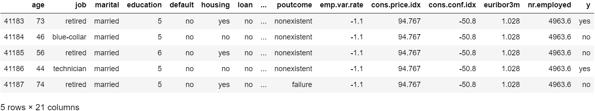
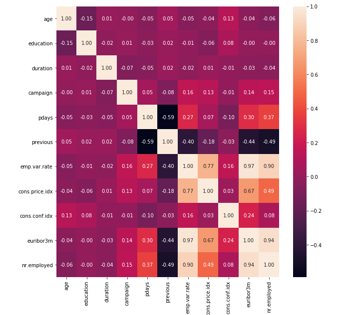
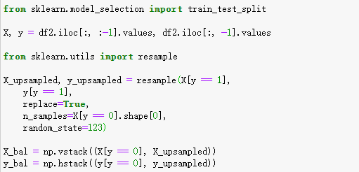
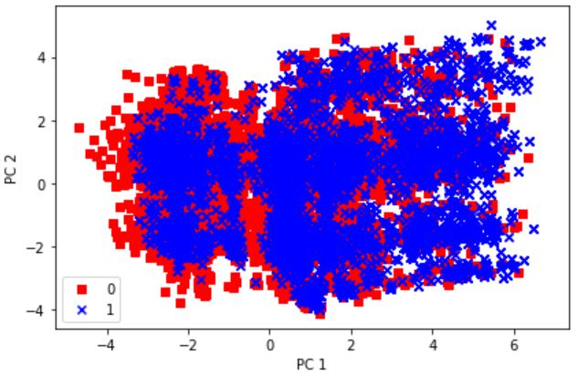
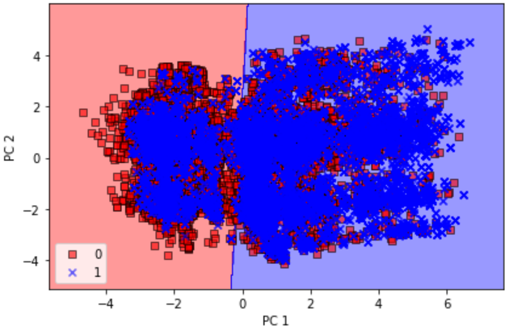
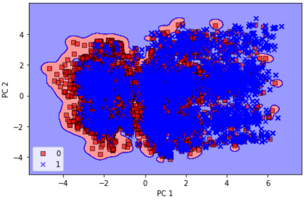
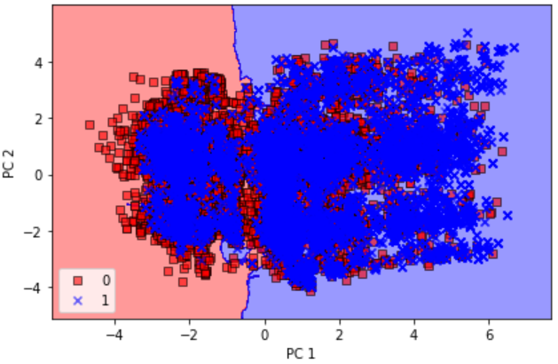
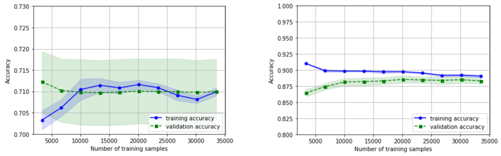
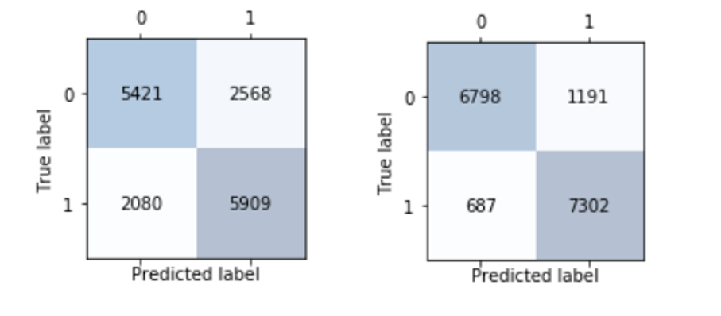
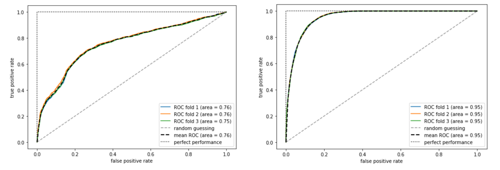

# Predicting Bank Term Deposit Subscription

|     Name    | Student ID |
|-------------| ---------- | 
|[Chang Xinlei](https://github.com/Johnxinlei)| 1801212779 | 
|[Wang  Lu](https://github.com/wltll)| 1801212803 |
|[Huang Zongmin](https://github.com/dylanhzm)| 1801212785 |
|[Wang Lei](https://github.com/wlfengwuhen)| 1801212802 |
|[Sun Xiuwen](https://github.com/Sunlalaa)| 1801212801 |

## 1.Introduction
Banking industry plays an important role in national economies. However, with the integration of global economy and innovation of financial instruments, traditional commercial banks are facing unprecedentedly fierce competition and high risk of losing customers. With the advent of the era of big data, the banks who can efficiently and effectively find, understand, and serve customers will take the lead in the fierce market competition. With the ability of analysis, prediction and insight of big data, we'd like to use machine learning method to predict results of bank marketing for certain types of customers and try to achieve precision marketing in the future.

Since term deposit is one major stable and credible financing source of banks, here we use data related to the marketing activities of Portuguese banking institutions to predict customers’ term deposit subscription behaviors and understand customers’ features to improve the effectiveness and accuracy of bank marketing. This forecast can help make a preliminary plan for future work of banks, and it also provides a reference for whether certain type of customers will subscribe to term deposits.

   Data Sources
   Created by: Paulo Cortez (Univ. Minho) and Sérgio Moro (ISCTE-IUL) @ 2012,  https://archive.ics.uci.edu/ml/datasets/Bank+Marketing.
   
|   Features  |    Type    | Description |
|-------------| ---------- | ----------  |
|age| numeric |age| 
|job| categorical|type of job "married","divorced","single"; note: "divorced" means divorced or widowed |
|marital| categorical|marital status "married","divorced","single"; note: "divorced" means divorced or widowed |
|education| categorical| "unknown","secondary","primary","tertiary" |
|default| categorical|has credit in default?  binary: "yes","no"|
|housing| categorical|has housing loan? binary: "yes","no"|
|loan| categorical| has personal loan? binary: "yes","no" related with the last contact of the current campaign|
|contact| categorical| contact communication type "unknown","telephone","cellular" |
|day| numeric| last contact day of the month|
|month| numeric|last contact month of year |
|duration | numeric| last contact duration, in seconds|
|campaign| numeric| number of contacts performed during this campaign and for this client|
|pdays| numeric| number of days that passed by after the client was last contacted from a previous campaign |
|previous| numeric| number of contacts performed before this campaign and for this client|
|poutcome| categorical| outcome of the previous marketing campaign |
|emp.var.rate| numeric| employment variation rate - quarterly indicator|
|cons.price.idx| numeric| consumer price index - monthly indicator|
|cons.conf.idx| numeric| consumer price index - monthly indicator|
|euribor3m| numeric| euribor 3 month rate - daily indicator |
|nr.employed| numeric| number of employees - quarterly indicator|
|y| categorical| has the client subscribed a term deposit?binary: "yes","no"|

## 2.Data description and processing:

The data is related with direct marketing campaigns of a Portuguese banking institution. It contains 41188 observations along with 20 features and 1 output variable shown below:

Steps for data processing
* Drop the observations which contains "unknown" value, then our observations count changes to 30488

* Calculate the coefficient of each variable(only numerical variables)

* Check the Imbalance of the data, for the explained variable y, the counts of "yes" and "no" are 3859 and 26629 ,which means the data   is very unbalanced. So we over-sampling the minority class unit the number of two class are equal

* Use "One-Hot Encoding" to divide category variables with multiple value into several dummy variables,because there are many category 
  variables in our dataset 

## 3.Model Training 
3.1 Applying PCA to the balanced data after standardization

After sliptting the original data into training set and test set, we apply standardization and PCA to the training set and transform the training set and test set. Then we can find that the explained variance ratio of the two largest conponents is more than 90%, so we choose two components for our following work.

The picture above shows the distribution of the training data afer using PCA. We can find that the data aren't linearly distributed. So linear clissification models may not work very well.

3.2 Using first 2 PC to train the logistic regresssion, SVM,KNN and decision tree.

The first classification model we used is Logistic Regression. The test accuracy is 0.709.

 

The second classification model we used is SVM with kernel, which is better for nonlinear data. The test accuracy is 0.725.

The third classification model we used is Decision Tree. The test accuracy is 0.867.

The fourth classification model we used is KNN. The test accuracy is 0.722.

3.3 Comparison:

Decision Tree is much better than the other models. SVM with kernel is very close to KNN and both are slitter better than Logistic. Regression. Decision tree, KNN and SVM with kernel is more suitbale for nonlinear classification.

## 4.CV and Model Evaluation

SVM is quiet time-consuming, and performed not very well in previous analysis, so we skip it in this part

4.1 CV and learning curves

First, we optimize the hyperparameters of the model by grid research using 10-fold cross validation. 

Under LR method, the optimal value for C is 1, with which we can reach an accuracy of 0.7100.

Under Decision Tree method, the Gini index performs better for Classification error, and we limit the max depth to 10 to avoid overfitting, getting an optimal accuracy of 0.9046.

Then, to diagnose whether this model has a problem with overfitting or underfitting, we plot the learning curve of our model. As the figure shows, LR model (left side) has small variance but relatively high bias (around 0.710), which may be our major challenge for model improvement. Decision Tree model (right side) has both small variance and small bias (around 0.890), which implies that it's a better model compared to LR. Also, we find that the accuracy is stable ahter the sample size reaches 10000, which suggests that a relative smaller sample size than current sample size (30488) will be enough for our model training and testing.

4.2 Evaluation Metrics

Next, we plot the confusion matrix of our models. 

For LR model (left side figure), we compute PRE as 69.7%, REC as 74.0% and F1 as 71.8%. Since we are aimed to find out the target clients who will subscribe term deposits, we care more about REC, which demonstrates the proportion of potential subscribers detected by the model. 74.0% of REC implies that among all the potential subscribers, our model can only detect 74.0% of them, which is acceptable but there is still much room for improvement.

For Decision Tree model (right side figure), we compute PRE as 86.0%, REC as 91.4% and F1 as 88.6%, which imply that the model performs quite well. 91.4% of REC implies that among all the potential subscribers, our model can detect 91.4% of them, which is quite satisfying.

4.3 ROC 

Finally, we plot the ROC curve of our model. The resulting ROC curve indicates that there is not much variance among the different folds, and the average ROC AUC for LR model (left side figure) is 0.76, which falls between a perfect score (1.0) and random guessing (0.5) and is acceptable. The average ROC AUC for Decision Tree model (right side figure) is 0.95, which shows that our model performs quite well.

|   Model   |    Accuracy    |    PRE    |    REC    |    F1     |  ROC AUC  |
|-----------| -------------- |-----------|-----------|-----------|-----------|
|    LR     |     0.7100     |   0.697   |   0.740   |   0.718   |   0.76    |
|    Decision tree     |     0.9046     |   0.860   |   0.914   |   0.886   |   0.95    |

## 5.Conclusion and Further Improvements
5.1 Conclusion

We use LR, SVM and decision tree models to make predictions. The accuracy of the model prediction before hyperparameter tuning is as follows:

|     MODEL   | ACCURACY |
|-------------| ---------- | 
|LR|0.709|
|SVM|0.725|
|Decision tree|0.867|

Decision Tree's performance is the best both before (part 3) and after (part 4) we tune the hyperparameters and it's REC is 91.4% and ROC AUC is 95%, which means through our model, we improve the effectiveness and accuracy of bank marketing significantly.

5.2 Further improvements

Based on the above model, we use the Ensemble learning to combine the above models
* Bagging  
we implement baggiing algorithm, and the train/test accuracies are 0.902/0.896

* AdaBoost   
we also implement AdaBoost algorithm, the train/test accuracies are 1.000/0.966

After using the ensemble learning method, we get obvious improvement, especially with AdaBoost algorithm.

